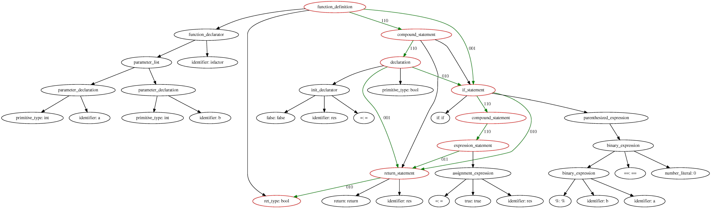
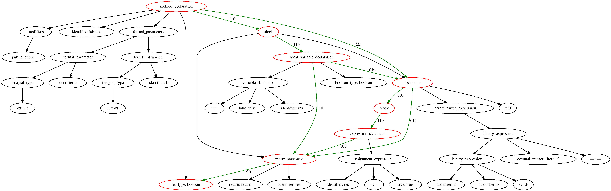

# CPG Construction
Tailor supports building code property graphs from code fragments written in C
and Java programming languages.
In particular, Tailor first extracts Abstract Syntax Trees (ASTs) from code
fragments, and then identifies control and data dependencies among code statements to construct code property graphs.

## Examples
Here we provide the code property graphs generated from two C and Java programs.

### C Program - determine whether `b` is `a's` factor or not.
```c
bool isfactor(int a, int b) {
	bool res = false;
	if (a % b == 0) {
		res = true;
	}
	return res;
}
```
* Generate Code Property Graph for the `C` example.
```bash
cd cpg/examples
python toy_visualization.py --lang c --path ./isfactor.c --fig_name ./example_c
```

* Code Property Graph - C



### Java Program - determine whether `b` is `a's` factor or not.
```java
public boolean isfactor(int a, int b) {
    boolean res = false;
    if (a % b == 0) {
        res = true;
    }
    return res;
}
```

* Generate Code Property Graph for the `java` example
```bash
cd cpg/examples
python toy_visualization.py --lang java --path ./isfactor.java --fig_name ./example_java
```

* Code Property Graph - Java


## Note
- Edge description: For clarity, we label AST edges, control dependencies and data dependencies in a code property graph, as follows:
    - `None`(`000`): AST edge
    - `010`: CFG edge
    - `001`: DFG edge
    - `110`: AST and CFG edge
    - `011`: CFG and DFG edge
    - `101`: AST and DFG edge
    - `111`: AST, CFG, and DFG edge
- Generality: Tailor currently supports C and Java programming languages.
  However, it is not limited to these two languages. Particularly, Tailor is
  based on [tree-sitter](https://tree-sitter.github.io/tree-sitter), which
  support AST extraction from around 40 different programming languages. Therefore, Tailor
  can be easily extended to support other programming languages.
- A few programs in our experimental datasets cannot be parsed by
  [tree-sitter](https://tree-sitter.github.io/tree-sitter). We hence manually
  modify them to generate ASTs.
